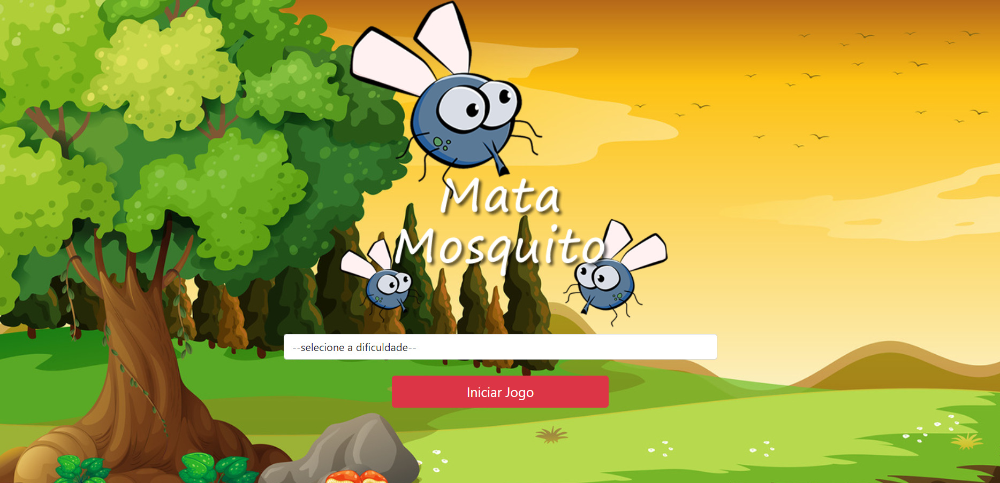

# Game mata-mosquito com Javascript

Esse é um game browser feito no curso de desenvolvimento web com jorge santanna, utilizando javascript, com o intuito de praticar os conceitos básicos da linguagem, e também manipulação do DOM, funções time, e a integração do script com diversas mídias.

## Table of contents

- [Overview](#overview)
  - [O Desafio](#O-desafio)
  - [Screenshot](#screenshot)
  - [Links](#links)
- [O processo](#o-processo)
  - [Construído com](#Construído-com)
  - [O que aprendi](#o-que-aprendi)

## Overview

### O desafio

Criar um jogo que roda um cronometro para completá-lo, com contador de vidas e que desenvolva a lógica por trás onde o objetivo é alcançado através de matar mosquitos com o clique, e esse clique faz o mosquito desaparecer, senão uma vida é decrescida do contador, e se o contador chegar a 0, o jogo é perdido. A vitória é alcançada se o jogador possuir vidas até o cronometro zerar.

### Screenshot

### Links

- Live Site URL: [Clique aqui](https://jimcarey08.github.io/Game-Mata-Mosquito/)

## O processo

### Construído com

- HTML5
- CSS
- Flexbox
- Javascript

### O que aprendi

Com esse projeto, coloquei em prática e adquiri confiança com a manipulação do DOM através de eventos e funções setTimeout(). Além disso controlar a aparição na tela (usando as dimensões da mesma juntamente com Math.random) dos mosquitos foi um grande aprendizado. Por outro lado a lógica por trás do jogo foi bem intuitiva.

Além do projeto que foi scriptado pelo curso, adicionei po conta própria algumas funcionalidades a mais, tais como, a animação do cursos ao clique, efeitos sonoros para cada ação e música de fundo. Tudo isso contribuiu para meu aprendizado em desenvolvimento WEB.

